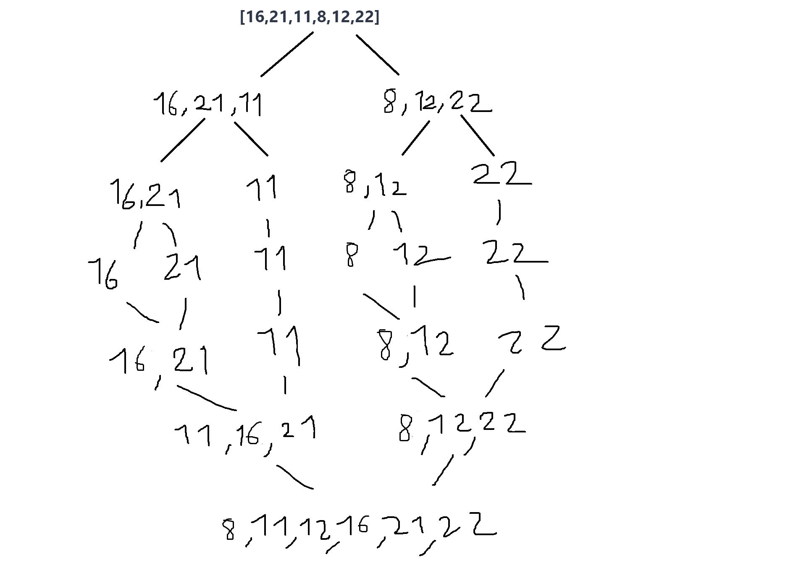

# Soru

## a) 

[16,21,11,8,12,22] -> Merge Sort

Yukarıdaki dizinin sort türüne göre aşamalarını yazınız.

## b)
Big-O gösterimini yazınız.

---

# Cevap

## a)

## b) 
1. 2^x=n
2. logn=x
3. O(nlogn)